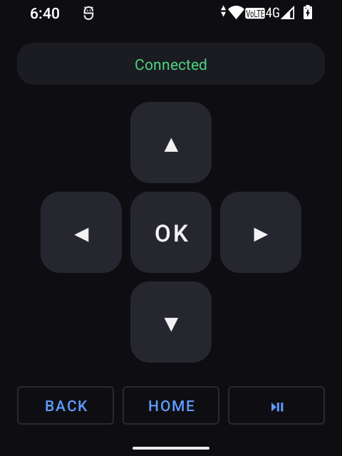

# SidePhone ATV Remote

[](https://github.com/dennisshey/tvremote/actions/workflows/ci.yml)



An Android app that turns a **[SidePhone SP-01](https://sidephone.com)** into a
physical remote for an **Apple TV** — navigate with the D-pad, type with the T9
keypad, no touchscreen required.

The SP-01 runs AOSP (Android 12, no Google services) and exposes its swappable
T9/QWERTY keypad as ordinary Android key events. This app captures those keys and
speaks Apple's **Companion** protocol directly to the Apple TV over Wi‑Fi — the
same protocol the iOS Remote and Control Center remote use — so button presses
arrive as native tvOS HID input.

> Built for the SP-01, but it runs on any Android 8+ phone with a hardware keypad
> or D‑pad.

---

## The keypad map

The **D-pad is primary**; the **T9 number pad doubles as a virtual D-pad** so a
keypad-only tile (no D-pad) is still fully usable.

| Key (SP-01) | Action |
|---|---|
| D‑pad ▲ ▼ ◀ ▶ | Navigate |
| D‑pad centre · **5** | Select |
| Back · ⌫ · **1** | Back |
| Menu key · **3** | Home |
| **2 4 6 8** | Up / Left / Right / Down (virtual D‑pad) |
| **0** | Play / Pause |
| **7** · **9** | Skip backward / forward (15 s) |
| **∗** · **#** | Volume − / + |
| Hold **#** | Siri |
| Hold **0** | Power (sleep / wake) |
| Hold **Back** / **⌫** | Home |
| Back swipe gesture | Leave the remote (device list) |
| Volume rocker | Apple TV volume (if the tile has one) |

The table lives in one place — [`KeyMapper.kt`](app/src/main/java/com/sidephone/atvremote/remote/KeyMapper.kt)
— and the in-app help screen is generated from it, so the docs can't drift from
the code. Re-map to taste by editing that single file.

---

## How it works

```
Hardware key ─▶ KeyMapper ─▶ RemoteAction ─▶ RemoteController ─▶ CompanionClient ─▶ Apple TV
   (KeyEvent)     (lookup)     (intent)         (queue/coroutine)   (Companion/HAP)   (tvOS HID)
```

1. **Discovery** — mDNS/NSD browses for `_companion-link._tcp` on the LAN.
2. **Pairing** (once per Apple TV) — HAP *pair-setup*: the TV shows a 4‑digit PIN,
   you type it on the keypad, and an SRP‑6a exchange yields long‑term credentials
   that are stored on the phone.
3. **Connect** — HAP *pair-verify* re-establishes a ChaCha20‑Poly1305 encrypted
   session from those credentials, then runs the tvOS session handshake.
4. **Control** — each key press is sent as a Companion HID button (down + up), or
   a media command for skip/transport.

The Companion/HAP implementation is a faithful Kotlin port of
[pyatv](https://github.com/postlund/pyatv). See
[`docs/DESIGN.md`](docs/DESIGN.md) for the full protocol walkthrough.

### Verified against the reference implementation

The pairing/session crypto is the part that must be **byte-exact** or the Apple TV
silently rejects it. Every layer is cross-checked against the authoritative Python
libraries the wire format comes from:

| Layer | Checked against |
|---|---|
| SRP‑6a (A, M1, shared key) | `srptools` |
| HKDF‑SHA512, ChaCha20‑Poly1305, Ed25519 | `cryptography` |
| OPACK, TLV8 | `pyatv` |

Those reference vectors ship as JVM unit tests in
[`CompanionCryptoTest.kt`](app/src/test/java/com/sidephone/atvremote/companion/CompanionCryptoTest.kt):

```bash
./gradlew test
```

---

## Install

Grab `sidephone-atv-remote.apk` from the
[latest release](https://github.com/dennisshey/tvremote/releases/latest) and
sideload it (the SP-01 has no Play Store):

```bash
adb install -r sidephone-atv-remote.apk
```

Release APKs are debug-signed by CI, so upgrading from a locally built APK (or
vice versa) needs an uninstall first.

## Build it yourself

```bash
# Build a debug APK
./gradlew assembleDebug          # -> app/build/outputs/apk/debug/app-debug.apk

# Install over ADB (enable Developer options ▸ USB debugging on the SP-01)
adb install -r app/build/outputs/apk/debug/app-debug.apk
```

Requirements: Android SDK with API 34, JDK 17. Opening the project in Android
Studio works too.

## Using it

1. Put the phone and the Apple TV on the **same Wi‑Fi network**.
2. Launch **SidePhone ATV Remote**. Pick your Apple TV from the list (or *Add by
   IP* if discovery is blocked on your network).
3. Enter the 4‑digit PIN shown on the TV. Pairing is remembered.
4. You're on the remote screen — the keypad now drives the Apple TV. The physical
   Back key is the Apple TV's Back; use the **system back gesture** (swipe from
   the screen edge) to leave the remote.

After the first pairing the app reconnects to your last-used Apple TV
automatically on launch; the back gesture drops you to the device list if you
need to switch TVs.

---

## Security notes

- Pairing credentials are stored in the app's private `SharedPreferences` in the
  pyatv-compatible `ltpk:ltsk:atvId:clientId` format. For a hardened build, swap
  [`CredentialStore`](app/src/main/java/com/sidephone/atvremote/remote/CredentialStore.kt)
  to `EncryptedSharedPreferences` (androidx.security) — the interface is already
  isolated for exactly this.
- All session traffic after pair-verify is ChaCha20‑Poly1305 encrypted; the PIN
  never leaves the phone (SRP proves knowledge of it without sending it).

## Scope & limitations

- **Companion protocol only** (modern tvOS). The older MRP protocol isn't
  implemented; the code is structured so it could be added alongside.
- Requires an Apple TV that can display a pairing PIN (all current models do).
- Tested end-to-end on an SP-01 driving an Apple TV 4K (AppleTV14,1) — pairing,
  reconnect, and every mapped key verified against real hardware. CI runs the
  crypto/serialization vector tests only; see `docs/DESIGN.md` for the exact
  handshake if you're debugging against a different tvOS build.
- Text entry (search fields) and app-launch shortcuts aren't wired up yet; the
  `CompanionClient` API has room for them.

## Project layout

```
app/src/main/java/com/sidephone/atvremote/
├── companion/   Companion + HAP protocol (pure JVM: crypto, OPACK, TLV8, framing)
├── remote/      Device-agnostic layer: KeyMapper, RemoteAction, discovery, controller
└── ui/          DiscoveryActivity, PairingActivity, RemoteActivity + views
```

## License

[MIT](LICENSE).

## Credits

Protocol details and reference behaviour from
[pyatv](https://github.com/postlund/pyatv) by Pierre Ståhl and contributors
(MIT). This project is not affiliated with or endorsed by Apple or SidePhone.
